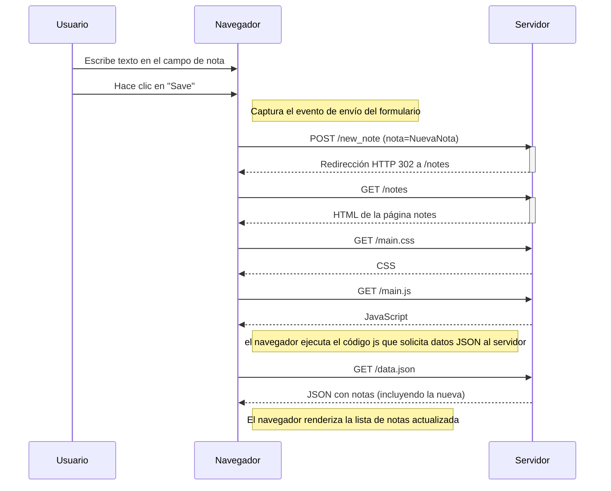

```mermaid
sequenceDiagram
    participant Usuario
    participant Navegador
    participant Servidor

    %% --- Creación de una nueva nota ---
    Usuario->>Navegador: Escribe texto en el campo de nota
    Usuario->>Navegador: Hace clic en "Save"

    Note right of Navegador: Captura el evento de envío del formulario

    Navegador->>Servidor: POST /new_note (nota=NuevaNota)
    activate Servidor
    Servidor-->>Navegador: Redirección HTTP 302 a /notes
    deactivate Servidor

    Navegador->>Servidor: GET /notes
    activate Servidor
    Servidor-->>Navegador: HTML de la página notes
    deactivate Servidor

    Navegador->>Servidor: GET /main.css
    Servidor-->>Navegador: CSS

    Navegador->>Servidor: GET /main.js
    Servidor-->>Navegador: JavaScript

    Note right of Navegador: el navegador  ejecuta el código js que solicita datos JSON al servidor

    Navegador->>Servidor: GET /data.json
    Servidor-->>Navegador: JSON con notas (incluyendo la nueva)

    Note right of Navegador: El navegador renderiza la lista de notas actualizada
```    