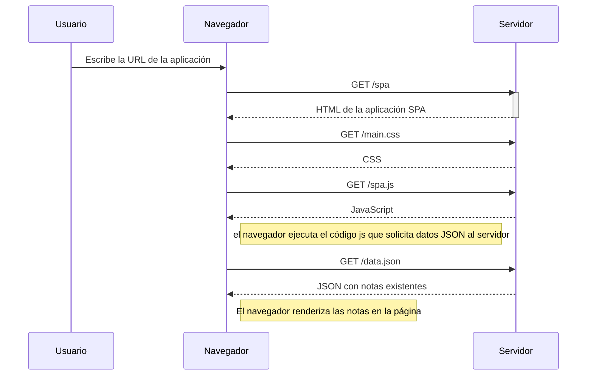

```mermaid
sequenceDiagram
    participant Usuario
    participant Navegador
    participant Servidor

    %% --- Carga inicial de la SPA ---
    Usuario->>Navegador: Escribe la URL de la aplicación
    Navegador->>Servidor: GET /spa
    activate Servidor
    Servidor-->>Navegador: HTML de la aplicación SPA
    deactivate Servidor

    Navegador->>Servidor: GET /main.css
    Servidor-->>Navegador: CSS

    Navegador->>Servidor: GET /spa.js
    Servidor-->>Navegador: JavaScript

    Note right of Navegador: el navegador ejecuta el código js que solicita datos JSON al servidor

    Navegador->>Servidor: GET /data.json
    Servidor-->>Navegador: JSON con notas existentes

    Note right of Navegador: El navegador renderiza las notas en la página
```    