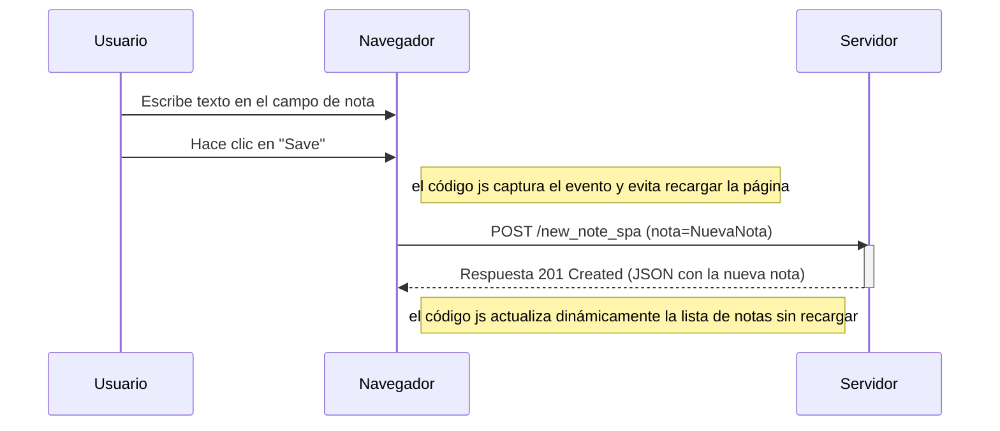

```mermaid
sequenceDiagram
    participant Usuario
    participant Navegador
    participant Servidor

    %% --- Crear nueva nota ---
    Usuario->>Navegador: Escribe texto en el campo de nota
    Usuario->>Navegador: Hace clic en "Save"

    Note right of Navegador: el código js captura el evento y evita recargar la página

    Navegador->>Servidor: POST /new_note_spa (nota=NuevaNota)
    activate Servidor
    Servidor-->>Navegador: Respuesta 201 Created (JSON con la nueva nota)
    deactivate Servidor

    Note right of Navegador: el código js actualiza dinámicamente la lista de notas sin recargar
```    